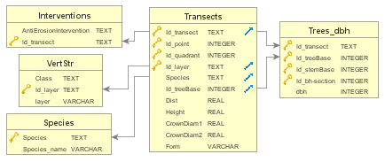
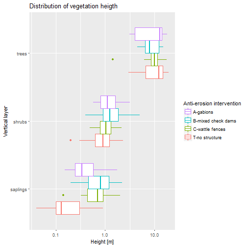
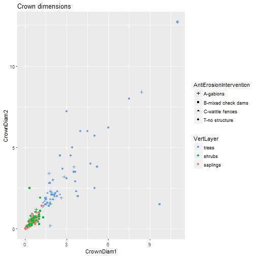
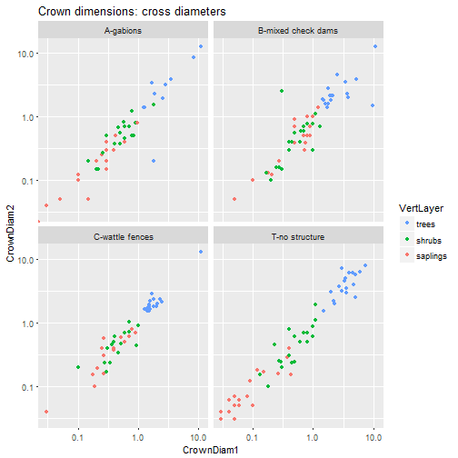
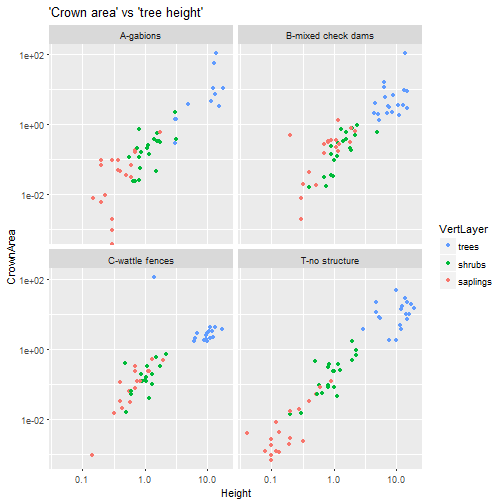
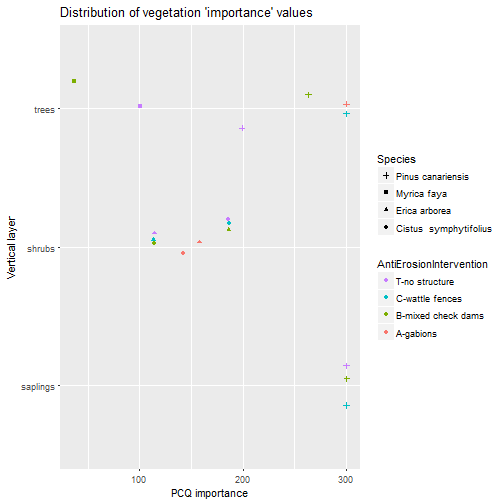
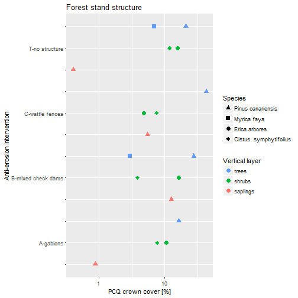
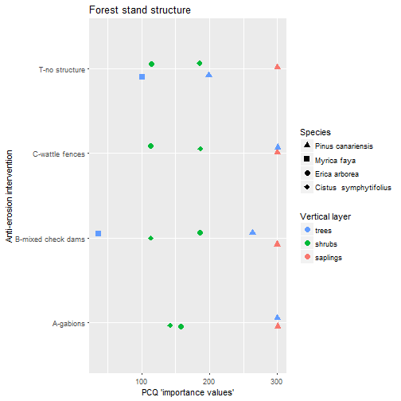

```r
rm(list=ls())
knitr::opts_chunk$set(results = 'hold')
# knitr::opts_chunk$set(tidy = TRUE, results = 'hold')
dbname <- "2017LovreglioEtAl_PCQM-Tenerife.sqlite"
```


# Database structure


### Some specifications.
Tables in the first column simply decode the correspondent Id's used in the 'Transects' table which actually collects almost all the information.  
Table 'Trees_dbh' is required to acquire 'brest heigth diameter (dbh)' of trees that have more than one 'brest heigth' crossection connected to a common 'base' (or root system: e.g. in coppices or forked stems). In the present case, having only one 'dbh' for each 'base'(*), 'dbh' could have been recorded instead of 'Id_treeBase'

(* Verification: see below)


```r
# ```{r read-data, tidy=FALSE, results="markup"}
library(tidyverse, warn.conflicts = FALSE, verbose = FALSE, quietly = TRUE )
```

```
## -- Attaching packages ----------------------------------- tidyverse 1.2.0 --
```

```
## v ggplot2 2.2.1     v purrr   0.2.4
## v tibble  1.3.4     v dplyr   0.7.4
## v tidyr   0.7.2     v stringr 1.2.0
## v readr   1.1.1     v forcats 0.2.0
```

```
## -- Conflicts -------------------------------------- tidyverse_conflicts() --
## x dplyr::filter() masks stats::filter()
## x dplyr::lag()    masks stats::lag()
```

```r
options(width = 120)
DB <- src_sqlite(path = dbname)
db_list_tables(DB$con)

tabs <- tribble(
  ~ord,          ~table,   ~tibble  
,    0, "Interventions",   "N/A"
,    1,       "VertStr",   "N/A"
,    2,       "Species",   "N/A"
,    3,     "Transects",   "N/A"
,    4,     "Trees_dbh",   "N/A"
)
# use 'table' name as default 'tibble' name
tabs$tibble[tabs$tibble=="N/A"] <- tabs$table
## Acquisizione tabelle da DB
for (i in 1:nrow(tabs)) {
  assign(tabs$tibble[i], eval.parent(as_tibble(tbl(DB, tabs$table[i]))))
  print(" ")
  print(" |--------------------- ")
  print(paste("\\ /  Table:", tabs$tibble[i]))
  print(get(tabs$tibble[i]), n=3)
  # Sys.sleep(2)
}
### Verify (*)  [one single 'dbh' for each 'treeBase']

# Trees_dbh <- rbind(Trees_dbh, Trees_dbh[1,]) ## Just for testing!
if (nrow(unique(Trees_dbh[,c("Id_transect", "Id_treeBase")]))!=nrow(Trees_dbh)) {
  stop("There is more than 1 dbh for each tree-base!")
} else print(" [Ok: there is one single 'dbh' for each 'treeBase'")
```

```
## [1] "Interventions" "Species"       "Transects"     "Trees_dbh"     "VertStr"      
## [1] " "
## [1] " |--------------------- "
## [1] "\\ /  Table: Interventions"
## # A tibble: 4 x 3
##   AntiErosionIntervention Id_transect AEI_lbl
##                     <chr>       <chr>   <chr>
## 1                 gabions           A    <NA>
## 2        mixed check dams           B    <NA>
## 3           wattle fences           C    <NA>
## # ... with 1 more rows
## [1] " "
## [1] " |--------------------- "
## [1] "\\ /  Table: VertStr"
## # A tibble: 3 x 3
##          Class Id_layer    layer
##          <chr>    <chr>    <chr>
## 1       Albero       L1    trees
## 2      Arbusto       L2   shrubs
## 3 Rinnovazione       L3 saplings
## [1] " "
## [1] " |--------------------- "
## [1] "\\ /  Table: Species"
## # A tibble: 4 x 2
##   Species           Species_name
##     <chr>                  <chr>
## 1    Pcan      Pinus canariensis
## 2    Earb          Erica arborea
## 3    Csym Cistus  symphytifolius
## # ... with 1 more rows
## [1] " "
## [1] " |--------------------- "
## [1] "\\ /  Table: Transects"
## # A tibble: 213 x 11
##   Id_transect Id_point Id_quadrant Id_layer Species Id_treeBase  Dist Height CrownDiam1 CrownDiam2  Form
##         <chr>    <int>       <int>    <chr>   <chr>       <int> <dbl>  <dbl>      <dbl>      <dbl> <chr>
## 1           A        1           1       L1    Pcan           1  4.10   12.8       3.50       3.80     I
## 2           A        1           1       L3    Pcan          NA  8.00    0.6       0.20       0.20     I
## 3           A        1           1       L2    Earb          NA  3.49    3.1       1.82       1.55     N
## # ... with 210 more rows
## [1] " "
## [1] " |--------------------- "
## [1] "\\ /  Table: Trees_dbh"
## # A tibble: 65 x 5
##   Id_transect Id_treeBase Id_stemBase `Id_bh-section`   dbh
##         <chr>       <int>       <int>           <int> <int>
## 1           A           1           1               1    41
## 2           A           4           1               1    36
## 3           A           7           1               1    56
## # ... with 62 more rows
## [1] " [Ok: there is one single 'dbh' for each 'treeBase'"
```

# Processing

```r
#```{r processig, results="markup"}
rm(list = ls())
library(Rmisc)
```

```
## Error in library(Rmisc): there is no package called 'Rmisc'
```

```r
# 'tidyverse' carica 'dplyr', se viene prima di 'Rmisc', genera questo avviso:
#### --------------------------------------------------------------------
####   You have loaded plyr after dplyr - this is likely to cause problems.
#### If you need functions from both plyr and dplyr, please load plyr first, then dplyr:
####   library(plyr); library(dplyr)
#### --------------------------------------------------------------------
library(tidyverse, warn.conflicts = FALSE, verbose = FALSE, quietly = TRUE )
library(rlang)
```

```
## 
## Attaching package: 'rlang'
```

```
## The following objects are masked from 'package:purrr':
## 
##     %@%, %||%, as_function, flatten, flatten_chr, flatten_dbl, flatten_int, flatten_lgl, invoke,
##     list_along, modify, prepend, rep_along, splice
```

```
## The following object is masked from 'package:tibble':
## 
##     has_name
```

```r
library(magrittr)
```

```
## 
## Attaching package: 'magrittr'
```

```
## The following object is masked from 'package:rlang':
## 
##     set_names
```

```
## The following object is masked from 'package:purrr':
## 
##     set_names
```

```
## The following object is masked from 'package:tidyr':
## 
##     extract
```

```r
# source("http://math.hws.edu/pcqm/pcqm.txt") 
# original source, documented in https://arxiv.org/abs/1010.3303
#                 pdf in https://arxiv.org/pdf/1010.3303.pdf
source("Mitchell/pcqm.txt")
source("F_PCQstats.R")

dbname <- "2017LovreglioEtAl_PCQM-Tenerife.sqlite"
DB <- src_sqlite(path = dbname)
Transects <- as_tibble(tbl(DB, "Transects")) %>% 
  left_join(as_tibble(tbl(DB, "Interventions"))) %>% 
  left_join(as_tibble(tbl(DB, "VertStr"))) %>% 
  left_join(as_tibble(tbl(DB, "Species"))) %>% 
  left_join(as_tibble(tbl(DB, "Trees_dbh"))) %>% 
  mutate(
    AntiErosionIntervention = factor(
      paste(Id_transect,AntiErosionIntervention, sep="-")),
    VertLayer = factor(layer),
    Sp = Species,
    Species = factor(Species_name),
    Point = factor(paste0(.$Id_transect,.$Id_point)),
    Quarter = factor(Id_quadrant)
  )
```

```
## Joining, by = "Id_transect"
```

```
## Joining, by = "Id_layer"
```

```
## Joining, by = "Species"
```

```
## Joining, by = c("Id_transect", "Id_treeBase")
```

```r
Transects$AntiErosionIntervention <- 
  factor(Transects$AntiErosionIntervention, 
         levels = rev(sort(levels(Transects$AntiErosionIntervention))))

ggplot(Transects, aes(VertLayer, Height)) + 
  geom_boxplot(aes(colour = AntiErosionIntervention)) + 
  guides(col = guide_legend(reverse=TRUE, title = "Anti-erosion intervention")) +
  scale_y_log10() + 
  labs(x="Vertical layer", y="Height [m]", title="Distribution of vegetation heigth") +
  coord_flip()
```



```r
ggplot(Transects, aes(CrownDiam1, CrownDiam2)) + 
  geom_point(aes(shape = AntiErosionIntervention, 
                 col = VertLayer)) + 
  guides(col = guide_legend(reverse=TRUE)) +
  guides(shape = guide_legend(reverse=TRUE)) +
  labs(title="Crown dimensions")
```



```r
Transects$AntiErosionIntervention <- 
  factor(Transects$AntiErosionIntervention, 
         levels = (sort(levels(Transects$AntiErosionIntervention))))
ggplot(Transects, aes(CrownDiam1, CrownDiam2)) + 
  geom_point(aes(col = VertLayer)) + 
  guides(col = guide_legend(reverse=TRUE)) +
  facet_wrap(~AntiErosionIntervention) +
  scale_x_log10() + scale_y_log10() +
  labs(title="Crown dimensions: cross diameters")
```

```
## Warning: Transformation introduced infinite values in continuous x-axis
```

```
## Warning: Transformation introduced infinite values in continuous y-axis
```



```r
Transects <- Transects %>% mutate(CrownArea = CrownDiam1*CrownDiam2*pi/4)
ggplot(Transects, aes(Height, CrownArea)) +
  geom_point(aes(col = VertLayer, title="Vertical layer")) + 
  guides(col = guide_legend(reverse=TRUE)) +
  facet_wrap(~AntiErosionIntervention) +
  scale_x_log10() + scale_y_log10() +
  labs(title="'Crown area' vs 'tree height'")
```

```
## Warning: Ignoring unknown aesthetics: title

## Warning: Transformation introduced infinite values in continuous y-axis
```



```r
# da fare: height ~ dbh

# PCQ computation, by Layer and Transect,  using <crownCover> as 'cover'
PCQtabByLyTr <- Transects %>%
  mutate(Cov = CrownDiam1 * CrownDiam2 * pi/4) %>%
  group_by(Id_layer, Id_transect) %>%
  do(PCQstats(., Cover=Cov))
```

```
## Warning in density.est(.): Some points do not have 4 observations. Using Warde and Petranka's Method.
```

```
## Joining, by = "Species"
```

```
## Joining, by = c("Species", "meanCover")
```

```
## Joining, by = "Species"
```

```
## Warning in density.est(.): Some points do not have 4 observations. Using Warde and Petranka's Method.
```

```
## Joining, by = "Species"
```

```
## Joining, by = c("Species", "meanCover")
```

```
## Joining, by = "Species"
## Joining, by = "Species"
```

```
## Joining, by = c("Species", "meanCover")
```

```
## Joining, by = "Species"
```

```
## Warning in density.est(.): Some points do not have 4 observations. Using Warde and Petranka's Method.
```

```
## Joining, by = "Species"
```

```
## Joining, by = c("Species", "meanCover")
```

```
## Joining, by = "Species"
## Joining, by = "Species"
```

```
## Joining, by = c("Species", "meanCover")
```

```
## Joining, by = "Species"
## Joining, by = "Species"
```

```
## Joining, by = c("Species", "meanCover")
```

```
## Joining, by = "Species"
## Joining, by = "Species"
```

```
## Joining, by = c("Species", "meanCover")
```

```
## Joining, by = "Species"
## Joining, by = "Species"
```

```
## Joining, by = c("Species", "meanCover")
```

```
## Joining, by = "Species"
```

```
## Warning in density.est(.): Some points do not have 4 observations. Using Warde and Petranka's Method.
```

```
## Joining, by = "Species"
```

```
## Joining, by = c("Species", "meanCover")
```

```
## Joining, by = "Species"
```

```
## Warning in density.est(.): Some points do not have 4 observations. Using Warde and Petranka's Method.
```

```
## Joining, by = "Species"
```

```
## Joining, by = c("Species", "meanCover")
```

```
## Joining, by = "Species"
## Joining, by = "Species"
```

```
## Joining, by = c("Species", "meanCover")
```

```
## Joining, by = "Species"
```

```
## Warning in density.est(.): Some points do not have 4 observations. Using Warde and Petranka's Method.
```

```
## Joining, by = "Species"
```

```
## Joining, by = c("Species", "meanCover")
```

```
## Joining, by = "Species"
```

```r
# PCQ computation, by Layer (pooling Transects),  using <crownCover> as 'cover'
PCQtabByLy <- Transects %>%
  mutate(Cov = CrownDiam1 * CrownDiam2 * pi/4) %>%
  group_by(Id_layer) %>%
  do(PCQstats(., Cover=Cov))
```

```
## Warning in density.est(.): Some points do not have 4 observations. Using Warde and Petranka's Method.
```

```
## Joining, by = "Species"
```

```
## Joining, by = c("Species", "meanCover")
```

```
## Joining, by = "Species"
## Joining, by = "Species"
```

```
## Joining, by = c("Species", "meanCover")
```

```
## Joining, by = "Species"
```

```
## Warning in density.est(.): Some points do not have 4 observations. Using Warde and Petranka's Method.
```

```
## Joining, by = "Species"
```

```
## Joining, by = c("Species", "meanCover")
```

```
## Joining, by = "Species"
```

```r
print("Internal Control table: mean density computed averaging 'by transect' estimations is not identical to 'pooled transects' estimation")
PCQtabByLyTr %>%
  group_by(Id_layer, Species) %>%
  dplyr::summarise(dens_byTrAvg = mean(densPartBySp)) %>%
  full_join(PCQtabByLy[,c(1,2,5)]) %>%
  dplyr::rename(dens_allTr = densPartBySp) %>%
  mutate(r= dens_byTrAvg / dens_allTr)
```

```
## Joining, by = c("Id_layer", "Species")
```

```r
PCQtabByLyTr1 <- Transects %>%
  mutate(Cov = CrownDiam1 * CrownDiam2 * pi/4) %>%
  group_by(VertLayer, AntiErosionIntervention) %>%
  do(PCQstats(., Cover=Cov))
```

```
## Warning in density.est(.): Some points do not have 4 observations. Using Warde and Petranka's Method.
```

```
## Joining, by = "Species"
```

```
## Joining, by = c("Species", "meanCover")
```

```
## Joining, by = "Species"
```

```
## Warning in density.est(.): Some points do not have 4 observations. Using Warde and Petranka's Method.
```

```
## Joining, by = "Species"
```

```
## Joining, by = c("Species", "meanCover")
```

```
## Joining, by = "Species"
## Joining, by = "Species"
```

```
## Joining, by = c("Species", "meanCover")
```

```
## Joining, by = "Species"
```

```
## Warning in density.est(.): Some points do not have 4 observations. Using Warde and Petranka's Method.
```

```
## Joining, by = "Species"
```

```
## Joining, by = c("Species", "meanCover")
```

```
## Joining, by = "Species"
## Joining, by = "Species"
```

```
## Joining, by = c("Species", "meanCover")
```

```
## Joining, by = "Species"
## Joining, by = "Species"
```

```
## Joining, by = c("Species", "meanCover")
```

```
## Joining, by = "Species"
## Joining, by = "Species"
```

```
## Joining, by = c("Species", "meanCover")
```

```
## Joining, by = "Species"
## Joining, by = "Species"
```

```
## Joining, by = c("Species", "meanCover")
```

```
## Joining, by = "Species"
```

```
## Warning in density.est(.): Some points do not have 4 observations. Using Warde and Petranka's Method.
```

```
## Joining, by = "Species"
```

```
## Joining, by = c("Species", "meanCover")
```

```
## Joining, by = "Species"
```

```
## Warning in density.est(.): Some points do not have 4 observations. Using Warde and Petranka's Method.
```

```
## Joining, by = "Species"
```

```
## Joining, by = c("Species", "meanCover")
```

```
## Joining, by = "Species"
## Joining, by = "Species"
```

```
## Joining, by = c("Species", "meanCover")
```

```
## Joining, by = "Species"
```

```
## Warning in density.est(.): Some points do not have 4 observations. Using Warde and Petranka's Method.
```

```
## Joining, by = "Species"
```

```
## Joining, by = c("Species", "meanCover")
```

```
## Joining, by = "Species"
```

```r
print("Table 1: 'Density by intervention type and vertical layer")
PCQtabByLyTr1 %>%
  group_by(AntiErosionIntervention, VertLayer, Species) %>%
  dplyr::summarise(densBySp = mean(densPartBySp)) %>%
  group_by(AntiErosionIntervention, VertLayer) %>%
  dplyr::summarise(dens = sum(densBySp)) %>%
  mutate(density = round(dens,1)) %>%
  select(AntiErosionIntervention, VertLayer, density) %>%
  spread(VertLayer, density)

print("Table 2: 'Density by vertical layer")
PCQtabByLyTr1 %>%
  group_by(VertLayer, Species) %>%
  dplyr::summarise(densBySp = mean(densPartBySp)) %>%
  group_by(VertLayer) %>%
  dplyr::summarise(dens = sum(densBySp)) %>%
  mutate(dens_r = round(dens,1)) %>%
  select(VertLayer, dens_r) %>%
  spread(VertLayer, dens_r)

#OLD
PCQtabByLyTr1 %>% mutate(Importance =relDensBySp+rDominance+relFrq) %>%
  ggplot(aes(VertLayer, Importance)) + 
  geom_jitter(aes(col = AntiErosionIntervention, 
                 shape = Species),
              height = .1, width = .2) + 
  guides(col = guide_legend(reverse=TRUE)) +
  guides(shape = guide_legend(reverse=TRUE)) +
  labs(x="Vertical layer", y="PCQ importance",
       title="Distribution of vegetation 'importance' values") +
  coord_flip()
```



```r
## knitr configuration: http://yihui.name/knitr/options#chunk_options
# opts_chunk$set(comment = "", error= TRUE, warning = FALSE, message = FALSE,
#               tidy = FALSE, cache = F, echo = T,
#               fig.width = 6, fig.height = 6)

## R configuration
options(width = 116, scipen = 5)

lbls <- rep("", 4*3)
lbls[c(2,5,8,11)] <- PCQtabByLyTr1 %$% levels(AntiErosionIntervention)

PCQtabByLyTr1 %>% mutate(pctCrownCover = Dominance * 100 / 10000 ) %>%
  ggplot(aes(pctCrownCover, interaction(VertLayer, AntiErosionIntervention))) + 
  geom_point(aes(col = VertLayer, 
                 shape = Species), size = 3) + 
  scale_shape_manual(values = c(18, 16, 15, 17)) +
  scale_x_log10() + 
  guides(col = guide_legend(reverse=TRUE, title = "Vertical layer")) +
  guides(shape = guide_legend(reverse=TRUE)) +
  labs(y="Anti-erosion intervention", x="PCQ crown cover [%]",
       title="Forest stand structure") +
  scale_y_discrete(labels = lbls)
```



```r
PCQtabByLyTr1 %>% mutate(Importance =relDensBySp+rDominance+relFrq) %>%
  ggplot(aes(AntiErosionIntervention, Importance, group=VertLayer)) + 
  geom_jitter(aes(col = VertLayer, 
                 shape = Species), size = 3,
              height = .3, width = .1) + 
  scale_shape_manual(values = c(18, 16, 15, 17)) +
  guides(col = guide_legend(reverse=TRUE, title = "Vertical layer")) +
  guides(shape = guide_legend(reverse=TRUE)) +
  labs(x="Anti-erosion intervention", y="PCQ 'importance values'",
       title="Forest stand structure") +
  coord_flip()
```



```
## Downloaded: importance.val( ) 
## Downloaded: density.est( ) 
## Downloaded: angle.order.est( ) 
## Downloaded: np.density.est( ) 
## [1] "Internal Control table: mean density computed averaging 'by transect' estimations is not identical to 'pooled transects' estimation"
## # A tibble: 5 x 5
## # Groups:   Id_layer [3]
##   Id_layer                Species dens_byTrAvg dens_allTr         r
##      <chr>                 <fctr>        <dbl>      <dbl>     <dbl>
## 1       L1            Myrica faya     47.88789   26.49472 1.8074500
## 2       L1      Pinus canariensis    234.78733  188.77491 1.2437422
## 3       L2 Cistus  symphytifolius   4067.85017 4005.30642 1.0156152
## 4       L2          Erica arborea   2432.78186 2612.15636 0.9313309
## 5       L3      Pinus canariensis   2606.31570 2155.21902 1.2093043
## [1] "Table 1: 'Density by intervention type and vertical layer"
## # A tibble: 4 x 4
## # Groups:   AntiErosionIntervention [4]
##   AntiErosionIntervention saplings shrubs trees
## *                  <fctr>    <dbl>  <dbl> <dbl>
## 1               A-gabions   1016.1 5461.6  85.6
## 2      B-mixed check dams   3921.5 6453.3 288.6
## 3         C-wattle fences   3334.2 5631.0 453.7
## 4          T-no structure   2153.5 8456.6 207.1
## [1] "Table 2: 'Density by vertical layer"
## # A tibble: 1 x 3
##   saplings shrubs trees
## *    <dbl>  <dbl> <dbl>
## 1   2606.3 6500.6 282.7
```


